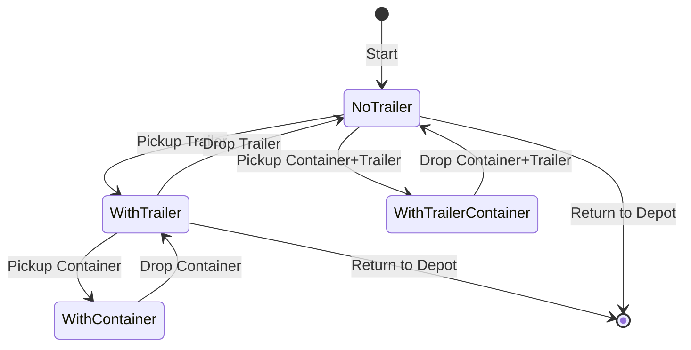
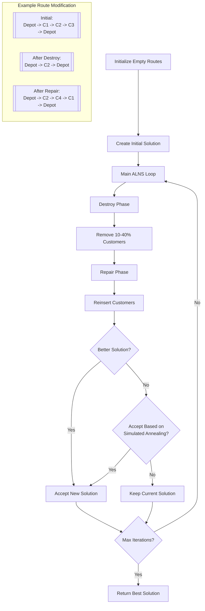
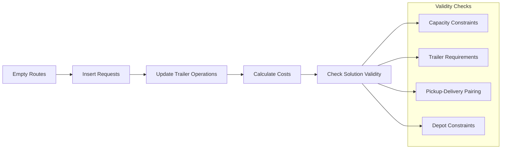
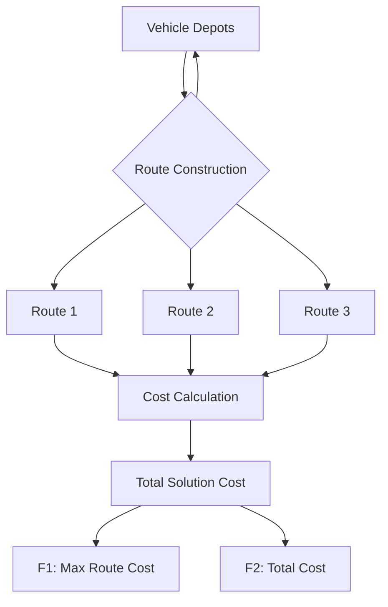

# Pickup and Delivery Problem Solver with Multiple Depots and Trailer Management

This C++ implementation solves a variant of the Vehicle Routing Problem (VRP) that includes pickup and delivery operations with trailer management and multiple depot support. The solver uses Adaptive Large Neighborhood Search (ALNS) with Simulated Annealing for optimization.

## Problem Description

### Key Components

1. **Multiple Depots**: Each vehicle can start and end at different depots
2. **Trailer Management**: Some operations require a trailer which must be picked up/dropped at specific points
3. **Container Operations**: Two types of container operations:
   - Regular pickup/drop (requires trailer)
   - Combined container-trailer pickup/drop

### Vehicle Operations



### Data Structures

1. **Request**
   - Pickup location and action
   - Delivery location and action
   - Operation durations
   - Request ID

2. **Route**
   - Start depot
   - End depot
   - Sequence of stops
   - Total cost

3. **Stop**
   - Location
   - Action type
   - Duration
   - Request ID

## Algorithm Overview

### Main ALNS Flow



### Solution Construction



### Multi-Depot Handling



## Usage Example

```cpp
// Define requests
std::vector<Request> requests = {
    {0, 1, PICKUP_CONTAINER_TRAILER, 10, 2, DROP_CONTAINER, 10},
    // ... more requests
};

// Define vehicle depots (depot)
std::vector<int> vehicle_depots = {
    0,  // Vehicle 1: depot 0 
    1,  // Vehicle 2: depot 1 
    2   // Vehicle 3: depot 2 
};

// Create and run solver
PDPSolver solver(requests, distances, vehicle_depots, alpha, trailer_point, trailer_pickup_time);
solver.solve();
solver.printSolution();
```

## Implementation Details

### Key Parameters

- `maxIterations`: Maximum ALNS iterations (default: 25)
- `temperature`: Initial temperature for simulated annealing (default: 100.0)
- `coolingRate`: Temperature cooling rate (default: 0.9995)
- `alpha`: Weight for balancing max route cost vs total cost

### Complexity

- Time Complexity: O(n²) for each iteration where n is the number of requests
- Space Complexity: O(n) for storing solutions and temporary routes

## Solution Quality Metrics

1. **F1**: Maximum route cost (weighted by alpha)
2. **F2**: Total solution cost
3. **Objective Function**: alpha * F1 + F2

## Constraints

1. Vehicle capacity: Maximum one container at a time
2. Trailer requirements:
   - Must have trailer for regular container operations
   - Special handling for container+trailer operations
3. Depot constraints:
   - Each vehicle must start/end at specified depots
   - Routes can use any depot for trailer operations

## Building and Running

```bash
g++ -std=c++11 main.cpp -o pdp_solver
./pdp_solver
```
